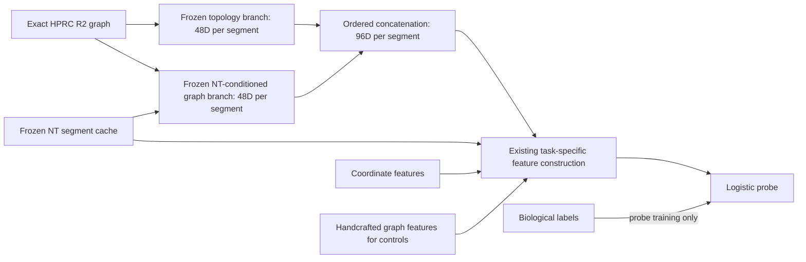

# PangenomeFM: model and downstream evidence status

Last verified 27 September 2026, 22:07 EDT. Technical work only; no manuscript edits.
Branch: `codex/v2-evidence-review-20260927`.

## What changed in this execution

The frozen two-branch candidate has completed the original-budget comparison
at all three initialization seeds. It beats both-random in every seed on SVs
and cCREs, but the trained-topology-versus-random-topology increment is not
consistently positive. Thus the full development gate does **not** replicate.
The uniform 4,000-iteration comparison is now complete at all three seeds;
all 144 compared fits converge, but the same two scientific gates still fail.
A controlled weak-head transfer diagnostic is running. TraitGym now has a
completed 60-run locus-prior matrix and a separately specified allele-score
sensitivity completed; the additional allele scores did not rescue the combined model. The candidate specification is fixed, but no final
superiority or NMI-readiness claim is supported.

- [x] Complete eight new frozen biological probes: four branch combinations ×
  SV/cCRE; replay metrics and verify identical examples, labels and baselines.
- [x] Complete trained/random coordinate-stream ablations and verify the same
  2,050 reconstruction validation candidates and frozen NT cache.
- [x] Consolidate **52 context rows across 26 evaluation groups**, including
  all EN-TEx tasks, sensitivities, tissues, ENCODE subsets and external HG008.
  These are not 26 independent new benchmarks.
- [x] Map both official TraitGym matched datasets without dropping examples;
  verify all 14,780 reference alleles against the actual HPRC graph sequence.
- [x] Verify actual frozen v1 topology coverage for every TraitGym variant in
  all 30 fold/seed/context caches, including checkpoint/holdout provenance: 100%.
- [x] Audit the existing HGSVC3 inversion annotations: 300 source events,
  298 mapped primary-chromosome events; preserve the two unmapped contig events.
- [x] Freeze the candidate and remaining-seed replication protocol before
  observing the new seeds.
- [x] Finish seed 314159: 4 pretraining fits and 16 biological probes; all
  native audits completed, including the unfavorable cCRE contrast.
- [x] Finish all twelve selected-architecture reconstruction runs across three
  seeds (two trained branches and their random controls per seed).
- [x] Finish seed-20260806 biological probing and consolidate every seed.
  The original-budget three-seed report is complete; failed contrasts are retained.
- [x] Complete the seed-42 4,000-iteration probe sensitivity: all 48 compared
  feature fits converge (maximum 1,192 iterations); its development gate passes.
- [x] Complete the same sensitivity at both remaining seeds. All compared
  fits converge; seed 314159 still fails the cCRE partial-random contrast and
  seed 20260806 still fails the SV partial-random contrast.
- [x] Complete the full TraitGym adaptation: 60 runs / 540 converged fits, with
  exact independent prediction replay. Retain negative/inconclusive topology gains.
- [x] Audit the missing variant bases in inherited segment NT inputs.
- [x] Complete the TraitGym NT-2.5B allele-score sensitivity: 60 runs / 480
  converged fits. No positive topology interval; C+S+V underperforms C+S for
  Mendelian traits despite V being informative alone.
- [ ] Complete the fixed weak-head transfer diagnostic; it is running.
- [ ] Replicate across chromosome folds and run the selected candidate on new
  downstream endpoints; the full v2 matrix is not completed.

Detailed earlier repairs and failures remain in
[the execution record](MODEL_REPAIR_EXECUTION_20260927.md).

## Complete downstream inventory and actual performance

The full, reproducible [Markdown scorecard](../results/foundation_evidence_20260927/task_scorecard/completed_downstream_tasks.md)
and [CSV](../results/foundation_evidence_20260927/task_scorecard/completed_downstream_tasks.csv)
include C+S AP, C+S+T AP, paired gain, 95% interval, run count and source path.
Every gain is checked against the difference of the corresponding means.
This is source-table consolidation, not retraining or a fresh replay of every
historical prediction. No favorable-result selection is applied.
The [complete gain overview](../results/foundation_evidence_20260927/task_scorecard/downstream_topology_gains.pdf)
shows every context row and interval; external HG008 is displayed separately
because its interval is much wider. Panel scales are explicitly marked.

| Family | Completed scope | What the evidence supports |
|---|---|---|
| ENCODE cCRE | Binary; PLS, pELS, dELS, CTCF-only versus common background; three complexity strata | Small original T gains. Subclass rows use subsets of binary-probe predictions, not separately trained subtype models. |
| HGSVC3 SV | INS versus DEL; length, frequency, complexity and donor strata | Strong original T contribution. This is not SV discovery or a breakpoint/non-breakpoint task. |
| EN-TEx P0 | Global AS-prone cCRE, exposure matched, H3K27ac-only, CTCF-only, complexity analyses | Global effect inconclusive; some predefined sensitivity effects have positive bootstrap intervals. Exposure matching changes the population/prevalence. |
| EN-TEx P1 | Five distal-enhancer tissue tasks and macro average | Macro effect inconclusive. Retain all tissues, including negative/inconclusive effects. |
| EN-TEx P2 / RNA | CTCF, H3K27ac, RNA ASE, ATAC, H3K4me3, H3K27me3 | CTCF/H3K27ac gains are small; H3K4me3 has positive bootstrap intervals. RNA, ATAC and H3K27me3 are inconclusive in the main paired comparisons. |
| EN-TEx follow-ups | Donor, exposure/equal-locus, complexity, normalized AP, AUROC and multiplicity checks | Completed supporting analyses; these do not create independent new benchmark replications. |
| HG008 | 30/30 prospective refit evaluations, 69 clonal INS/DEL variants | Gains +0.032525 strict / +0.064863 one-hop, both with intervals crossing zero. One genome; no HG008 training. Six historical replay failures remain distinct from successful prospective refits. |
| H/R controls | Full 120-evaluation v1 matrix | Strict SV trained-minus-random after C+S+H +0.005295; one-hop SV and cCRE provide weaker evidence. Handcrafted/random controls are essential. |
| Scaling | 120 intrinsic and 360 biological runs complete | More data helps strict SV and one-hop cCRE, but does not uniformly improve biological transfer. v1 reconstruction retains the documented shortcut limitation. |
| Graph transfer | Historical cross-resource/release evaluations | Completed under v1; corrected-objective transfer has not been established. |
| TraitGym locus priors | Complex and Mendelian traits; 60 runs, 540 converged fits | No positive topology interval; original segment NT sampling drops most tested bases. Five-fold adaptation, not the official leaderboard. |

The complete EN-TEx primary/sensitivity/tissue/RNA/extension matrix contains
450 runs. Completed does not mean a positive hypothesis test. Five-fold
hierarchical bootstrap intervals are also not equivalent to five-cluster
exact sign-flip significance; the latter has limited resolution.

### Corrections to the supplied external summaries

The attached suggestions contain useful directions and several stale or
incorrect details. Actual code/data/results take precedence:

- The original server resources are accessible and the EN-TEx matrix is
  complete; this is no longer a missing-graph/data-preparation-only project.
- The historical SV endpoint is INS versus DEL, not breakpoint detection.
  An inversion row cannot be added by changing its binary label to DEL.
- Strict/one-hop describes graph context, not a TSS classification rule.
- CTCF/H3K27ac SNV experiments use the full accessible EN-TEx call set;
  the downloaded high-confidence file contains RNA-seq measurements.
- Window-count scaling has completed; it is not donor/haplotype-count scaling.
- HG008 prospective probe refits completed, while exact historical replay is
  a different claim. Positive point estimates with wide intervals crossing
  zero are inconclusive, not an automatic scientific pass.
- A shared segment vector is a locus representation, not an allele-specific
  embedding. No arbitrary haplotype ID or mismatched GBZ node frequency was
  added to make an allele-aware claim.
- The repository uses audited NPZ caches and exact SHA-256 resource identities;
  illustrative CSV filenames or commands in the suggestions are not real
  replacements for the repository's pipeline.

No supplied document instruction to change the graph, fine-tune NT with labels,
or substitute a success threshold overrides the frozen, controlled evaluation.

## Frozen architecture candidate

**Candidate specification is fixed; scientific validation is incomplete.**

| Part | Fixed choice |
|---|---|
| Reference resource | Exact manuscript HPRC R2 SV graph and 5 Mb windows; unchanged checksums |
| Topology branch T | Existing dual-stream encoder; hidden 48, two layers, four heads; typed bidirectional graph messages; coordinate attention with multiscale/orientation RoPE |
| T inputs | Existing seven structural/coordinate inputs; degree recomputed on visible graph; unmasked component identity removed |
| Sequence-context branch Q | Same encoder dimensions; seven inputs plus 512D frozen NT-v2 50M segment embeddings |
| Pretraining | Degree-balanced junction re-pairing, span size 16; whole-group masking; reverse and reverse-complement hidden links removed; signed-offset/gap bins with ratio 1.25 |
| Heads | Existing MLP for T; linear products/absolute-differences interaction scorer for Q; choices selected by reconstruction validation before biological fitting |
| Representation | Ordered concatenation [T,Q], 48+48=96 dimensions; no fitted fusion weights |
| Biological learning | Existing logistic probe only; both encoders and NT remain frozen |
| Scope | One-hop development; strict remains ineligible under the current geometry-matching protocol |



The two branches learn only from the repaired, label-free junction task before
freezing. SV endpoint-pair construction and cCRE segment construction retain
their existing definitions; 96D describes each segment before task aggregation.

No new sequence model, graph release, biological fine-tuning, tissue selection,
or learned biological fusion gate was introduced. Q is sequence-conditioned;
the combined representation must not be called topology-only T.

The [analysis plan](../configs/frozen_branch_analysis_plan_20260927.json) specifies
all controls, validity checks, decision criteria and limitations. The extractor
rejects different branch universes/counts/policies. Probes verify both
checkpoints' test and validation chromosomes, context and seed.

### Observed validation AUPRC

Original 800-iteration budget; fold A, seed 42, one-hop. Same 91,932 training / 43,217 validation SV examples
and 164,435 / 73,988 cCRE examples. **No test-chromosome predictions.**

| Representation E | SV C+S+E | SV C+S+H+E | cCRE C+S+E | cCRE C+S+H+E |
|---|---:|---:|---:|---:|
| T only | 0.911535 | 0.916828 | 0.916260 | 0.916574 |
| Q only | 0.892733 | 0.905693 | 0.920388 | 0.920628 |
| T + Q | **0.914380** | **0.918485** | **0.920474** | **0.920716** |
| T + random Q | 0.911685 | 0.916654 | 0.919189 | 0.919687 |
| Random T + Q | 0.912297 | 0.915482 | 0.920153 | 0.920347 |
| Both random | 0.909148 | 0.913255 | 0.919008 | 0.919493 |

After C+S+H, the two trained branches beat both-random by +0.005230 SV and
+0.001223 cCRE. Replacing only trained T with random T loses +0.003003 SV
and +0.000368 cCRE. Replacing only trained Q loses +0.001831 SV and +0.001029
cCRE. Thus the cCRE evidence for T's learned weights remains small.

The extra gain over the better single branch is +0.001657 SV and +0.000088
cCRE after C+S+H. Do not describe the tiny cCRE difference as a replicated
improvement. The practical result is preserving both task strengths with one
fixed representation while passing the same-dimension controls.

**Numerical caveat:** subsequent log inspection found two convergence warnings
in each seed-42 composite SV probe log, and none in the corresponding cCRE logs.
The historical logs did not identify which feature fit issued each warning.
The original development gate therefore required a fixed 4,000-iteration
sensitivity with per-feature iteration/convergence receipts. The completed
seed-42 result immediately below resolves this numerical check for that seed.
Only the optimizer's iteration ceiling changes; estimator, class weighting,
regularization, feature definitions, checkpoints and examples remain fixed.
The probes re-extract frozen features on GPU, which can introduce small
floating-point differences; every score change cannot be attributed solely
to the larger iteration budget. This is not
a search for a better biological score.

[Audited per-run table](../results/foundation_evidence_20260927/composite_biological_analysis/audited_per_run.csv)
· [Paired contrasts](../results/foundation_evidence_20260927/composite_biological_analysis/paired_differences.csv)
· [Gate](../results/foundation_evidence_20260927/composite_biological_analysis/development_gate.json)
· [Gain figure](../results/foundation_evidence_20260927/composite_biological_analysis/frozen_branch_gains.pdf).
All existing SV strata, including sparse/undefined bins, remain in
`all_sv_strata.csv`.

### Completed numerical check: seed 42, maximum 4,000 iterations

All sixteen probes completed. The six-model comparison contains 48 feature
fits; all converge, using at most 1,192 iterations. Every matched control gain
retains its sign, and the development gate passes after the numerical check.

| Task, after C+S+H | T+Q AP | Both-random AP | Gain over both-random | Gain over random T+Q | Gain over T+random Q |
|---|---:|---:|---:|---:|---:|
| SV INS/DEL | 0.918519 | 0.913187 | +0.005332 | +0.003031 | +0.001872 |
| cCRE | 0.920713 | 0.919445 | +0.001268 | +0.000309 | +0.001024 |

Gain over the better trained single branch is +0.001827 SV and +0.000093 cCRE.
The very small cCRE difference remains a point estimate on an inspected fold.
The same fixed sensitivity is complete at both other seeds; the uniform
three-seed summary below retains the failed contrasts. No original result is replaced or omitted.

[Converged comparison](../results/foundation_evidence_20260927/probe_convergence_4000_analysis/audited_per_run.csv)
· [Per-fit iteration counts](../results/foundation_evidence_20260927/probe_convergence_4000_analysis/probe_optimization.csv)
· [Numerical and performance gates](../results/foundation_evidence_20260927/probe_convergence_4000_analysis/development_gate.json).

### First additional initialization seed: 314159

All sixteen biological probes completed using the fixed protocol, with the
same validation examples and invariant C+S/C+S+H predictions across models.
These remain development-validation scores, not independent chromosome tests.

| Task, after C+S+H | T+Q AP | Both-random AP | Gain over both-random | Gain over random T+Q | Gain over T+random Q |
|---|---:|---:|---:|---:|---:|
| SV INS/DEL | 0.917347 | 0.914144 | +0.003203 | +0.002027 | +0.000754 |
| cCRE | 0.920702 | 0.919643 | +0.001059 | **-0.000096** | +0.001212 |

The inherited per-seed gate reports **not_promoted** because cCRE fails the
trained-topology-versus-random-topology comparison. This result is retained;
no replacement seed, head, feature choice or threshold was selected. The final
seed completed unchanged; its results follow below. The numerical solver
sensitivity is separate.

Reconstruction gains replicate qualitatively: topology trained/random AP is
0.731156/0.596269; NT-conditioned trained/random AP is 0.863401/0.626892.
All use the same 2,050 candidates, exact initialization controls and fixed
sequence cache. Better reconstruction still does not guarantee every
biological contrast is positive.

[Seed 314159 biological table](../results/foundation_evidence_20260927/frozen_branch_seed_replication/seed_314159/biological_analysis/audited_per_run.csv)
· [All paired contrasts](../results/foundation_evidence_20260927/frozen_branch_seed_replication/seed_314159/biological_analysis/paired_differences.csv)
· [Recorded failed gate](../results/foundation_evidence_20260927/frozen_branch_seed_replication/seed_314159/biological_analysis/development_gate.json).

## Complete three-seed biological replication at the original budget

The remaining 32 probes (16 per additional seed) and automatic consolidation
completed. This table summarizes all three seeds, after C+S+H, using the original
800-iteration ceiling. Means describe initialization variation on **one already
inspected validation fold**; they are not independent-chromosome estimates.
Some SV fits reached that ceiling. The uniform convergence reruns remain separate.

| Task | Comparator subtracted from T+Q | Mean Δ AP | Seed SD | Positive seeds |
|---|---|---:|---:|---:|
| SV | Both-random | +0.003725 | 0.001323 | 3/3 |
| SV | Random T + trained Q | +0.001676 | 0.001533 | 2/3 |
| SV | Trained T + random Q | +0.001360 | 0.000551 | 3/3 |
| SV | Trained T only | +0.001426 | 0.000270 | 3/3 |
| cCRE | Both-random | +0.001256 | 0.000215 | 3/3 |
| cCRE | Random T + trained Q | +0.000149 | 0.000233 | 2/3 |
| cCRE | Trained T + random Q | +0.001073 | 0.000123 | 3/3 |
| cCRE | Trained Q only | +0.000243 | 0.000274 | 3/3 |

Seed 20260806 reaches T+Q AP 0.916371 SV and 0.921184 cCRE. Its SV comparison
against random T+Q is -0.00000128: effectively a numerical near-tie, but it does
not satisfy the prespecified positive-gain rule. Seed 314159's cCRE comparison
is -0.00009561. Therefore **not every seed passes the development gate**. The
threshold is unchanged, and no seed is dropped or replaced.

The most consistent learned-branch contribution in this development experiment
comes from Q. The incremental contribution of trained T beyond Q and H remains
weaker. This supports further controlled model work, not a claim that every
biological task has improved or that all benchmarks should now be expanded.

[All 144 compared feature rows](../results/foundation_evidence_20260927/frozen_branch_seed_replication_analysis/audited_per_run.csv)
· [All paired seed contrasts](../results/foundation_evidence_20260927/frozen_branch_seed_replication_analysis/paired_per_seed.csv)
· [Mean/SD/range summary](../results/foundation_evidence_20260927/frozen_branch_seed_replication_analysis/seed_summary.csv)
· [Seed stability figure](../results/foundation_evidence_20260927/frozen_branch_seed_replication_analysis/frozen_branch_seed_stability.pdf).

## Complete three-seed numerical repair

All three seeds completed the same 4,000-iteration ceiling. The 144 feature fits in the six-model comparison converge, and the independently replayed 300 paired contrasts and summary tables agree exactly. These are one-fold development results, not independent chromosome confirmation.

| Task | Comparator subtracted from T+Q after C+S+H | Mean ΔAP | Seed SD | Positive seeds |
|---|---|---:|---:|---:|
| sv | T_Q minus Rt_Rq | +0.003577 | 0.001557 | 3/3 |
| sv | T_Q minus Rt_Q | +0.001544 | 0.001529 | 2/3 |
| sv | T_Q minus T_Rq | +0.001402 | 0.000535 | 3/3 |
| ccre | T_Q minus Rt_Rq | +0.001282 | 0.000208 | 3/3 |
| ccre | T_Q minus Rt_Q | +0.000108 | 0.000214 | 2/3 |
| ccre | T_Q minus T_Rq | +0.001054 | 0.000122 | 3/3 |

The cCRE trained-T increment at seed 314159 is −0.000117; the SV increment at seed 20260806 is −0.000024. Both are now converged, so optimizer non-convergence does not explain these failures. No threshold or seed was changed.

[Converged summary](../results/foundation_evidence_20260927/seed_convergence_4000/analysis/seed_summary.csv) · [per-seed contrasts](../results/foundation_evidence_20260927/seed_convergence_4000/analysis/paired_per_seed.csv).

A separate [weak-head protocol](../configs/frozen_head_transfer_20260927.json) now tests the already pretrained bidirectional linear-head topology encoder, keeping the Q branch, biological probes, random controls and examples fixed. This is an adaptively motivated development diagnostic, not a replacement for the failed replication. It started after the convergence matrix completed; no additional pretraining or test-chromosome scoring is requested.

## Reconstruction across all three initialization seeds

The fixed architectures have completed reconstruction evaluation at every seed.
All use the same 2,050 validation candidates in 104 windows, verified by the
canonical integer-identity hash. These are initialization replications on one
development fold, with no chromosome-level confidence interval.

| Seed | T trained AP | T random AP | Q trained AP | Q random AP |
|---|---:|---:|---:|---:|
| 42 | 0.789716 | 0.625729 | 0.869981 | 0.654747 |
| 314159 | 0.731156 | 0.596269 | 0.863401 | 0.626892 |
| 20260806 | 0.690989 | 0.620547 | 0.875416 | 0.643347 |

Both branches beat their frozen-random controls at every seed on this surrogate
objective. This demonstrates learning in the repaired reconstruction task;
it does not establish consistent biological transfer or superiority over other
pretraining methods. Topology reconstruction is more sensitive to initialization.

The historical seed-42 topology checkpoint did not store its initial-weight
hash. Its matching configuration and unchanged random weights pass, but exact
starting-weight identity cannot be retrospectively certified from that checkpoint.
The two new topology seeds and all Q controls retain and verify initial hashes.
The [seed-42 re-audit](../results/foundation_evidence_20260927/junction_pilot_reaudit/audit.json)
also resolves an old hash-format difference (floating versus integer labels);
predictions and metrics were not changed.

## Graph-message ablation

Same NT inputs, candidates, partitions, linear head and maximum 10-epoch budget.
The coordinate stream retains visible degree; it is **not graph-free**.

| Model | Validation AP | Window-macro AUROC |
|---|---:|---:|
| Full NT-conditioned encoder, trained | 0.869981 | 0.904021 |
| Coordinate stream only, trained | 0.730937 | 0.756674 |
| Full NT-conditioned encoder, frozen random | 0.654747 | 0.693320 |
| Coordinate stream only, frozen random | 0.611729 | 0.622205 |

The trained full model exceeds its message ablation by +0.139044 AP.
This supports the graph-message component in this reconstruction setting.
It does not prove that every shortcut is removed or that the gain generalizes
to biological labels. Trained/random weights, exact candidate identities,
cache provenance and saved checkpoint scores pass the native report checks.

[Coordinate-ablation outputs](../results/foundation_evidence_20260927/nt_coordinate_analysis/validation_metrics.csv)
and [full-model outputs](../results/foundation_evidence_20260927/nt_junction_analysis/validation_metrics.csv)
retain complete metrics and audits.

## New downstream feasibility: actual data audits

### TraitGym

Pinned official dataset revision:
`1fde19555fe8c0a55b1382bdf4c6f7082209f566`; inspected author-code commit:
`4d80fe889415ffc02d45c7cb5446a326288819bd`.

| Official dataset | Examples | Positive | Unique loci | Graph / NT coverage | REF matches |
|---|---:|---:|---:|---:|---:|
| Complex traits, matched 1:9 | 11,400 | 1,140 | 11,400 | 100% / 100% | 11,400/11,400 |
| Mendelian traits, matched 1:9 | 3,380 | 338 | 3,354 | 100% / 100% | 3,380/3,380 |

No multi-segment SNVs or mixed-label loci. All rows and supplied match groups
are preserved. Positives and negatives both have 100% coverage. Chromosome X
has 500 Mendelian examples and is already covered by the existing fold C test
partition. An initial conversational assertion that X lacked a fold was
incorrect and was corrected against the actual configuration.

Coordinates are GRCh38, 1-based POS, mapped to [POS-1,POS), with no nearest
fallback. All 14,780 REF alleles match the original graph sequence. The two
viewer examples are deterministic source-order samples, independent of labels
or model scores. [Coverage and reference audit](../results/foundation_evidence_20260927/traitgym_reference_audit/audit.json).

**Actual topology coverage also passes:** all 11,400 complex-trait and 3,380
Mendelian variants are present in each of the 30 existing v1 frozen caches
(5 folds × 3 seeds × 2 contexts). Both label classes and every chromosome
retain 100% coverage. The audit checks cache checksums, original graph/manifest
identity, exact checkpoint hashes, validation/test chromosome exclusions,
seed/context and absence of downstream-label access. Distinct alleles at a
shared locus remain distinct examples.
[Full coverage/provenance audit](../results/foundation_evidence_20260927/traitgym_topology_coverage/audit.json)
· [All per-cache/class/chromosome counts](../results/foundation_evidence_20260927/traitgym_topology_coverage/coverage.csv).
This concerns v1 caches; it does not assert v2 coverage.

**The five-fold adaptation is now complete:** 60 runs / 540 converged fits,
with all original variants and groups retained. Primary ΔT is −0.002025 strict
and −0.000987 one-hop for complex traits; −0.005069 strict and +0.003954
one-hop for Mendelian traits. No positive 95% topology interval is established.
The original NT raw-node sampling removes the tested base for 77.1% and 72.2%
of complex and Mendelian variants, respectively. These results expose a
representation limitation; they are not a failure to map the data.

A separately specified allele-score sensitivity adds the authors' published,
pinned NT-2.5B signed/absolute likelihood ratios. All 60 runs and 480 fits completed and replayed. No topology interval is
positive; the Mendelian combined model underperforms its original baseline. This does not replace S, retrain an encoder, or change
the original results. Its prior observation of the original test results is
explicitly disclosed.

[Full team report, QC, results and commands](TRAITGYM_DOWNSTREAM_20260927.md)
· [Primary paired results](../results/foundation_evidence_20260927/traitgym_full_analysis/contrasts.csv)
· [Raw-sequence visibility](../results/foundation_evidence_20260927/traitgym_sequence_visibility/visibility.csv).

Official leave-one-chromosome-out probing and full published embedding-based
comparators remain separate work. The current results are a five-fold
adaptation, not directly comparable leaderboard numbers.
[Official implementation and metric](https://github.com/songlab-cal/TraitGym).

### HGSVC3 inversion / multiclass SV

The already downloaded annotation has **300 events**, including two nonprimary
contig events. All 298 events on primary chromosomes map both first/last affected
bases and have NT features. Test-fold support is 72, 74, 59, 42 and 51 inversions.
The two nonprimary events remain explicitly recorded, not silently discarded.
The historical mapper and binary probe now reject INV/DUP/other classes and
inconsistent binary targets, preventing accidental relabeling as DEL.

Use the TSV's SV-Pop BED+6 coordinate contract, verified against each event ID
and length. Preserve INV as its own type; the historical binary INS/DEL probe
must never label inversions as deletions.
[Readiness audit](../results/foundation_evidence_20260927/inversion_readiness/audit.json)
· [Fold support](../results/foundation_evidence_20260927/inversion_readiness/fold_support.csv).

**Next implementation:** disjoint event-level INS/DEL/INV labels, overlap
handling, one-vs-rest AP and length-matched controls. Complex events are not
automatically a mutually exclusive fourth class. The paper's broader complex-SV
count is not a ready GRCh38 multiclass table.
[HGSVC3 paper](https://www.nature.com/articles/s41586-025-09140-6),
[SV-Pop format](https://github.com/EichlerLab/svpop).

## Novelty and remaining evidence, in priority order

The defensible methods direction is **audited pangenome junction
self-supervision that controls endpoint-degree and genomic-geometry shortcuts,
with frozen biological reuse**. Whole-group masking and matched re-pairing are
the research-specific parts to assess. Bidirectionality, sequence concatenation,
linear probes and masked graph pretraining are not individually new.
GraphMAE already studies masked graph-feature reconstruction and MGAE studies
masked graph autoencoding. A complete novelty claim requires direct comparisons
to these approaches, not a new model name.
[GraphMAE](https://arxiv.org/abs/2205.10803),
[MGAE](https://arxiv.org/abs/2201.02534).

A further relevant baseline is **Topology Only Pre-Training (ToP)**, published
in May 2026. It removes node/edge attributes during contrastive pretraining and
studies transfer across graph domains. Thus topology-only pretraining and
multi-domain graph transfer are already established directions. Its reported
fine-tuning protocol differs from our frozen probes; an adapted comparison
would need to state that difference. It strengthens the case for evaluating
our junction objective against established graph self-supervision, rather than
claiming novelty from topology inputs alone.
[Davies et al., 2026](https://link.springer.com/article/10.1007/s10618-026-01210-1).

Degree correction itself is also established prior work. Aiyappa et al.
show that ordinary link sampling can favor degree-only predictors and propose
a degree-corrected task. FakeEdge addresses train/test connectivity shifts in
link prediction. Our observed masking-induced degree deficit and pangenome
geometry constraints must be distinguished from these mechanisms, and tested
against appropriate adaptations. Neither the existence of degree bias nor
removing queried links can support a standalone novelty claim.
[Implicit degree bias](https://arxiv.org/abs/2405.14985),
[FakeEdge](https://proceedings.mlr.press/v198/dong22a.html).

| Priority | Remaining work | Present status / concrete next action |
|---|---|---|
| 1 | Model transfer improvement | All three seeds numerically converged; mixed scientific gates persist. Prespecified weak-head diagnostic running |
| 2 | Chromosome replication and v2 task transfer | Not run; freeze protocol before additional label-informed choices |
| 3 | Established graph SSL, stronger sequence and nonlinear probe comparisons | Not completed; include GraphMAE/ToP-style controls, identical examples/input budgets and sequence truncation controls |
| 4 | TraitGym | Both 60-run adapted matrices complete; neither establishes a positive topology gain. Official LOCO and full embedding comparison remain separate |
| 5 | INV-containing SV type task | 298 primary events pass mapping/NT coverage; multiclass probe/overlap controls still needed |
| 6 | DART-Eval | Official suite identified; select coordinate-anchored tasks and audit coverage before claiming a comparable result |
| 7 | Measured SV genotypability | Variant-level leave-one-out outcomes and callable denominators still missing; FILTER, SVR and self-genotyping are not valid replacements |
| 8 | GTEx / SV-expression / trait links | Compact positive sets insufficient; obtain all-tested/callable universes before defining negatives |
| 9 | Path-aware RNA/methylation, donor scaling | Need verified haplotype-to-canonical-segment correspondence and donor-excluded graph design |
| 10 | Cross-graph correspondence / construction invariance | Need nontrivial sequence/assembly truth, coordinate controls and duplicate/sample-overlap audits |
| 11 | MPRA, constraint, tandem repeats, clinical SVs | Endpoint/ascertainment feasibility first; no completed PangenomeFM performance claims |
| 12 | Strict repaired pretraining | Fails matched-candidate support; do not relax matching to obtain a favorable number |

DART-Eval distinguishes zero-shot, probing and fine-tuning tracks; synthetic
sequences do not necessarily have an unambiguous genomic graph location.
[Official DART-Eval](https://github.com/kundajelab/DART-Eval).

The Genomic Intelligence catalog was inspected: available chromatin models use
supervised ENCODE labels, and its expression model uses ENCODE/GTEx-related data.
They can be declared supervised comparators after overlap review, not independent
ground truth or substitutes for the frozen NT baseline.
[Catalog snapshot](../results/foundation_evidence_20260927/plugin_model_catalog.json).
NGS Analysis Workbench's design skill guided the unit/contrast/validity-gate
plan. Biological Sequence & Alignment Viewer opens the actual reference
windows; its display is not a substitute for the complete programmatic REF check.

An additional public genotypability search inspected all **22,627 entries** in
the HGSVC3 publication working-data manifest. No filenames matched leave-one-out,
PanGenie, concordance or genotyping terms; the official README describes assembly
QC/annotation products. This bounds the search, not proof that outcomes do not
exist elsewhere or inside differently named files. The required per-variant
outcomes remain unresolved.
[Inventory audit](../results/foundation_evidence_20260927/genotypability_public_inventory.json)
· [Official archive README](https://ftp.1000genomes.ebi.ac.uk/vol1/ftp/data_collections/HGSVC3/working/20241218_phase3-main-pub_data/20241218_phase3-main-pub_data.README.txt).

## Reproduction and server continuation

Run from the evidence worktree with `PYTHONPATH=src:.`; use the existing
`pangenomefm-server` environment. No passwords are stored in commands/files.

```bash
# Rebuild the 52-row historical scorecard from the bundled compact sources.
PYTHONPATH=src:. python scripts/server/build_downstream_scorecard.py \
  --out-dir <fresh-scorecard-output>

# Replay the completed composite comparison on actual predictions.
PYTHONPATH=src:. python -m tasks.transfer.frozen_branch_report \
  --root <readiness-results>/composite_biological_validation \
  --topology-root <readiness-results>/biological_validation_common \
  --sequence-root <readiness-results>/nt_biological_validation \
  --out-dir <fresh-composite-report>

# Run the unchanged two-seed replication; all commands/receipts are saved.
PYTHONPATH=src:. python scripts/server/run_frozen_branch_seed_replication.py \
  --main-checkout /home/tuv43532/PangenomeFM \
  --audit-root /home/tuv43532/PangenomeFM_model_repair_20260927/results/foundation_evidence_20260927 \
  --nt-cache <evidence-results>/benchmark_nt_completion/benchmark_nt.npz \
  --topology-control-cache <existing-H-cache.npz> \
  --decision-gate <evidence-results>/composite_biological_analysis/development_gate.json \
  --out-root <fresh-replication-output> --execute

# After both seeds finish, retain every paired contrast; no chromosome CI.
PYTHONPATH=src:. python -m tasks.transfer.frozen_branch_replication_report \
  --sources <evidence-results>/composite_biological_analysis \
    <replication-output>/seed_314159/biological_analysis \
    <replication-output>/seed_20260806/biological_analysis \
  --out-dir <fresh-seed-summary>

# Repeat the complete TraitGym mapping/reference audit on the pinned files.
PYTHONPATH=src:. python scripts/server/audit_traitgym_coverage.py \
  --dataset complex_traits=data/external/traitgym_1fde195/complex_traits_matched_9.parquet \
  --dataset mendelian_traits=data/external/traitgym_1fde195/mendelian_traits_matched_9.parquet \
  --feature-cache completed_nt=<evidence-results>/benchmark_nt_completion/benchmark_nt.npz \
  --full-segments /home/tuv43532/PangenomeFM/server_workspace/data/processed/hprc_r2_sv/full_segments.csv.gz \
  --verify-reference --out-dir <fresh-traitgym-audit>

# Verify all 30 existing v1 topology caches on the prepared TraitGym examples.
PYTHONPATH=src:. python scripts/server/audit_traitgym_topology.py \
  --mapping-dir <traitgym-reference-audit> \
  --topology-cache-root /home/tuv43532/PangenomeFM/results/entex/v1/topology_cache_all_reference \
  --results-root /home/tuv43532/PangenomeFM/server_workspace/results/full_multicohort_server_20260806 \
  --manifest /home/tuv43532/PangenomeFM/server_workspace/data/benchmarks/hprc_r2_pretrain_5mb_paired/manifest.csv \
  --out-dir <fresh-traitgym-topology-audit>

# Audit the already downloaded inversion annotation; retain unmapped events.
PYTHONPATH=src:. python scripts/server/audit_inversion_readiness.py \
  --annotation /home/tuv43532/PangenomeFM/server_workspace/data/downstream/sv/hgsvc3/1.0/GRCh38/variants_GRCh38_sv_inv_HGSVC2024v1.0.tsv.gz \
  --full-segments /home/tuv43532/PangenomeFM/server_workspace/data/processed/hprc_r2_sv/full_segments.csv.gz \
  --sequence-cache <evidence-results>/benchmark_nt_completion/benchmark_nt.npz \
  --out-dir <fresh-inversion-audit>
```

Completed original-budget replication root:
`/home/tuv43532/PangenomeFM_evidence_report_20260927/results/foundation_evidence_20260927/frozen_branch_seed_replication`.
Tmux socket `evidence-20260927`, session `frozen_branch_seed_replication`.
`status.json` records stage completion and failures; each child retains commands,
native checkpoints, predictions and logs. A launched stage is not a completed
result. Historical and other-LLM worktrees are preserved.
The `frozen_branch_seed_report` tmux session completed successfully and created
the complete three-seed report at
`<readiness-results>/frozen_branch_seed_replication_analysis`. Its bounded failure handling records source-job or timeout errors and does
not treat a failed scientific gate as a missing result.
[Exact finalizer](../results/foundation_evidence_20260927/finalize_seed_replication.py).

The completed seed-42 convergence experiment is in
`/home/tuv43532/PangenomeFM_readiness_20260927/results/foundation_evidence_20260927/probe_convergence_4000`,
tmux session `probe_convergence_4000` on the same socket. Its
[exact command receipt](../results/foundation_evidence_20260927/probe_convergence_4000_launch.json)
and [launcher](../results/foundation_evidence_20260927/run_probe_convergence_4000.sh)
retain commit `c86d447`, all original checkpoint paths, and the fixed optimizer
budget. The same sensitivity completed at seeds 314159 and 20260806
because the first replication also had SV convergence warnings. All eight
model arms are included for both tasks, irrespective of performance.
The bounded continuation reuses the original recorded commands and changes
only the output root and uniform iteration ceiling; original results remain
intact. A convergence-aware three-seed report retains numerical failures as
well as failed performance gates.
[Continuation code](../scripts/server/run_frozen_branch_convergence.py)
· [Exact launch receipt](../results/foundation_evidence_20260927/seed_convergence_4000_launch.json).
The `seed_convergence_4000` tmux session completed both remaining seeds and
built the uniform-budget three-seed report. It uses
immutable copies of the committed driver/report beside the active checkout,
with file hashes recorded; running shared code is not modified. The native report will mark `optimization_incomplete` if any compared
probe remains unconverged. Use a fresh output root to reproduce it.

Validation: **383 local tests passed**, including bitwise default-probe
prediction equivalence; the nine targeted label/convergence tests also pass
in the server environment. The label-integrity check accepts all 173,969
historical INS/DEL examples (110,623 INS; 63,346 DEL). Cached manuscript AP
regression checks pass; they are not retraining.
